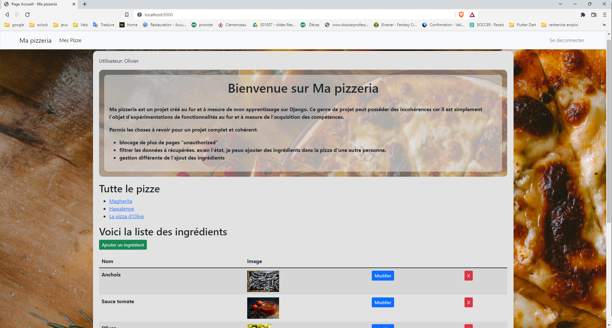
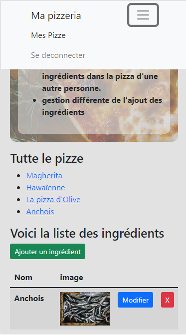
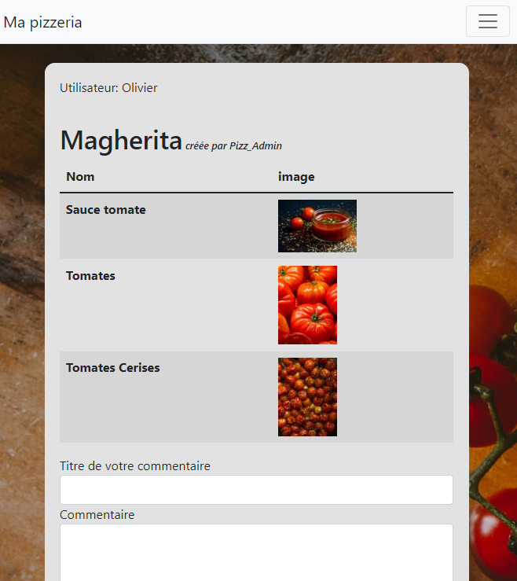

# django
some exercices with python and django

<h1>Rendu de l'application qui m'a servi à m'exercer</h1>

  <figure>
    <figcaption>Vue de la page d'accueil grands écran</figcaption>
    
  </figure>

<figure>
  
  <figcaption>Vue de la page d'accueil téléphone</figcaption>
</figure>

<figure>
  
  <figcaption>Vue de la page d'ajout d'une pizza</figcaption>
</figure>

<figure>
  
  <figcaption>Vue de la page dune pizza. Je peux commenter seulement si cette pizza n'est pas à moi.</figcaption>
</figure>

<figure>
  
  <figcaption>Vue de la page dune pizza. Je peux commenter seulement si cette pizza n'est pas à moi.</figcaption>
</figure>
