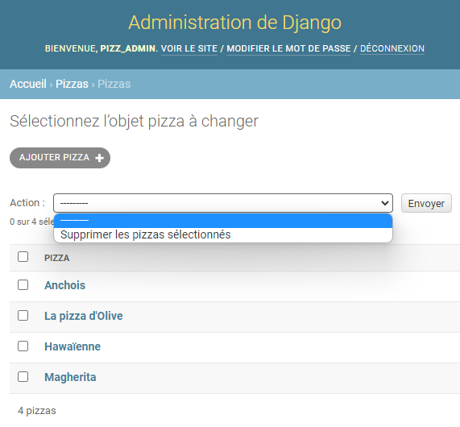
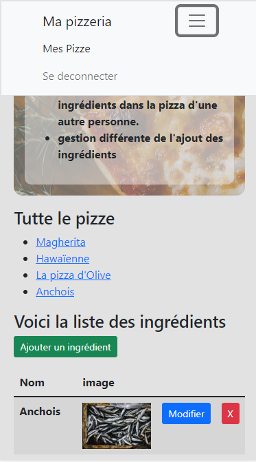
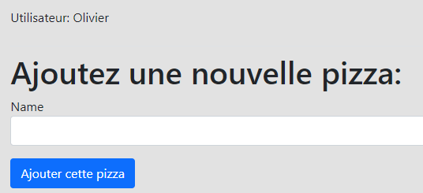
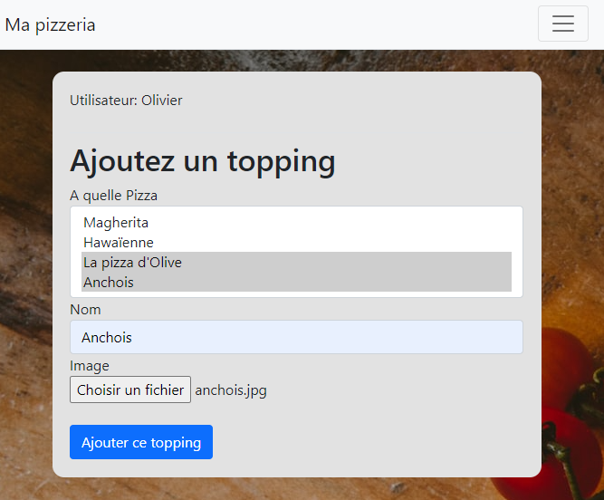
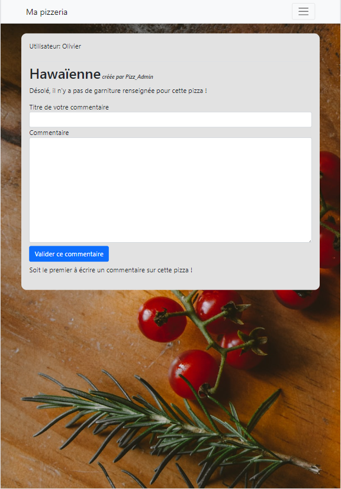

# django

<h1>Présentation de l'application</h1>

  Ma pizzeria est un projet créé au fur et à mesure de mon apprentissage sur Django. Ce genre de projet peut posséder des incohérences car il est simplement l'objet d'expérimentations de fonctionnalités au fur et à mesure de l'acquisition des compétences.

<h2>Parmis les fonctionnalités ok</h2>
<ul>
  <li>Administration</li>
  <li>Blocage de sections (@login_required)</li>
  <li>CRUD pizzas/ingrédients</li>
  <li>Ajouter des commentaires, empécher la possibilité de faire des commentaires sur sa propre Pizza</li>
  <li>Adapter l'affichage dans les templates par exemple en fonction de tableaux vides ou avec des données</li>
</ul>
<h2>Parmis les choses à revoir pour un projet complet et cohérent</h2>
<ul>
  <li>blocage de plus de pages "unauthorized"</li>
  <li>filtrer les données à récupérer. ex: en l'état, je peux ajouter des ingrédients dans la pizza d'une autre personne.</li>
  <li>gestion différente de l'ajout des ingrédients (inverser la logique... partir de la pizza et lui ajouter les ingrédients)</li>
  <li>gestion plus poussée des images (notamment sur l'update ou possibilité de ne pas déposer d'image / image par défaut) </li>
</ul>

<h1>Rendu de l'application qui m'a servi à m'exercer</h1>

<figure>
  <figcaption>Administration de Django</figcaption>
  
</figure>

<figure>
  <figcaption>Vue de la page d'accueil (grand écran)</figcaption>
  
</figure>

<figure>
  <figcaption>Vue de la page d'accueil téléphone</figcaption>
  
</figure>

<figure>
  <figcaption>Vue de la page d'ajout d'une pizza</figcaption>
  
</figure>

<figure>
  <figcaption>Vue de la page dune pizza. Je peux commenter seulement si cette pizza n'est pas à moi.</figcaption>
  
</figure>

<figure>
  <figcaption>Vue de la page dune pizza. Je ne peux pas commenter une pizza qui est à moi.</figcaption>
  
</figure>

<figure>
  <figcaption>Ajouter un ingrédients et l'associer à une/des pizza(s).</figcaption>
  
</figure>

<figure>
  <figcaption>Gestion de l'affichage des garnitures et commentaires (pas de garniture / pas de commentaire)</figcaption>
  
</figure>
